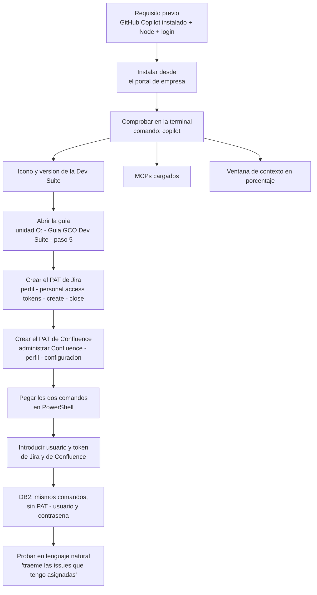

# Transcripción — Grabación de la Copilot Dev Suite

> Documento fuente. Recoge lo que se dijo en la grabación, sin editar el contenido: solo se corrigieron errores del reconocedor de voz y se le dio estructura de lectura. El registro completo de correcciones está al final. El original crudo está en `transcripcion_video_gco-dev-suite.bak.md`.

## Contenido

- [Parte 1 · Qué es y cómo se instala](#parte-1--qué-es-y-cómo-se-instala)
  - [Qué es GitHub Copilot](#qué-es-github-copilot)
  - [Qué es la Copilot Dev Suite](#qué-es-la-copilot-dev-suite)
  - [Cómo comprobar que NO está instalada](#cómo-comprobar-que-no-está-instalada)
  - [Qué es, en realidad: un conjunto de herramientas](#qué-es-en-realidad-un-conjunto-de-herramientas)
  - [Requisitos e instalación](#requisitos-e-instalación)
- [Parte 2 · Comprobación y configuración de credenciales](#parte-2--comprobación-y-configuración-de-credenciales)
  - [Comprobar que se instaló bien](#comprobar-que-se-instaló-bien)
  - [Dónde está la guía](#dónde-está-la-guía)
  - [El PAT de Jira](#el-pat-de-jira)
  - [El PAT de Confluence](#el-pat-de-confluence)
  - [Ejecutar los comandos en PowerShell](#ejecutar-los-comandos-en-powershell)
  - [DB2](#db2)
  - [Comprobar que Jira funciona](#comprobar-que-jira-funciona)
- [Resumen](#resumen)

---

## Parte 1 · Qué es y cómo se instala

Vale. Hola, Jamie. Eh, wow, qué raro se me está haciendo hablar solo. Bueno, eh, vale, explico qué es, ¿no?, la Copilot Dev Suite.

### Qué es GitHub Copilot

Yo lo que primero creo que estaría bien entender es que, por ejemplo, lo que es el Copilot en sí, ¿no? En plan, primero que, ¿qué es el Copilot?

El Copilot es esta aplicación que nos permite pues interactuar con varios modelos de inteligencia artificial que brinda la suscripción de GitHub Copilot. Esta es la aplicación de GitHub Copilot, que hay otras que tiene otros nombres y algunas se van parecidas [?], pero esta es la de GitHub Copilot.

Lo que nos permite esta aplicación es el hecho de pues poder usar, ¿no?, distintos modelos que tenemos nosotros e en la suscripción en este caso de GCO, que son pues todos estos y que se va actualizando conforme van saliendo eh nuevos modelos.

Bueno, y el Copilot en sí tiene muchas ventajas. No, que no solamente va a poder usar modelo, sino que nos brinda este entorno que nos permite pues la ejecución de skills, de MCPs y de otro tipo de herramientas que nos hacen la vida más fácil en general.

### Qué es la Copilot Dev Suite

Eh, ¿qué es la Copilot Dev Suite? Pues la Copilot Dev Suite es algo que hemos desarrollado nosotros o el equipo, ¿no?, entre Pasiona y Raona e que pues añade tanto skills como MCPs y algunos agentes. Ya todo pensado para poder ayudar a los trabajadores de GCO, pues ya sea tanto a nivel de COBOL, a nivel de .NET, eh de análisis, de conexión a bases de datos, Aida [?], todo este tipo de cosas.

### Cómo comprobar que NO está instalada

Ahora mismo en esta pantalla no está instalado el Copilot Dev Suite. Una forma que tenemos de comprobar que el Copilot Dev Suite no está instalado es que, por ejemplo, aquí no nos sale ningún indicador del MCP ni la versión de la Dev Suite, pero sobre todo por esto.

Podemos, por ejemplo, poner `mcp show`, que está. Creo que lo que este comando hace es que nos lista todos los MCPs, ¿no?, que tenemos disponibles ya configurados en el Copilot. Y como podemos ver, solo hay uno, mientras que el Copilot Dev Suite trae cinco o seis. Tenemos, bueno, cuando lo instalaremos lo veremos, pero ya tenemos:

- el de Jira
- el de Elastic
- el de Confluence
- el de eh Kibana
- DB2
- SQL

Todo esto que ya viene eh configurado en la Dev Suite.

También otra forma de comprobarlo, Skills. A ver, Taremos [?] pues estas dos que además son todo para poder customizar lo que es el agente de GitHub Copilot. Así que nada de COBOL, nada de C [?], nada de Chart [?], nada de lo que nos puede llegar a interesar, ¿vale?

### Qué es, en realidad: un conjunto de herramientas

Eh, la forma de instalarlo, bueno, ahora ya sabemos, ¿no?, que la Dev Suite es un conjunto ya de herramientas, ¿no?, de scripts, de MCPs, ya todas configuradas, ya todas creadas, ya todas testeadas para que el usuario ya nada más se lo descargue, pueda echar mano de ello, que lo pueda usar, que pueda decidir.

Eh, incluso muchas veces no sabemos a veces que necesitamos skills, y lo bueno de esto es por cómo funciona, que es por **autodescubrimiento**: nos permite a través del lenguaje natural interactuar con el Copilot y que el Copilot decida basado en el texto que le enviamos si tiene que ser una skill o no, lo cual es superinteresante, porque las skills son herramientas ultrapotentes y tiene todo el sentido del mundo querer sacar provecho de ellas, y a veces es una pena no acordarnos de que las tenemos y no usarlas.

### Requisitos e instalación

Por ende, bueno, pues para instalar la Copilot Dev Suite es tan sencillo como:

1. Evidentemente, que nos ten [?] el Copilot ya instalado, ¿no? Con todo lo que conlleva, que es sobre todo el Node.
2. Una vez ya el Copilot instalado, hayamos hecho, evidentemente, el login en que toca. No es que no puedas instalártelo si no tienes hecho login, pero simplemente no podrás usar el Copilot, por ende podrás sacar beneficio de la Copilot Dev Suite.

Porque la Copilot Dev Suite es eso: **es un añadido, es una capa extra que hemos añadido nosotros encima del Copilot**. Sigue siendo la misma aplicación. No tienes que entrar a una cosa al Copilot y a la otra Copilot Dev Suite. No, es el Copilot y es algo que se añade al Copilot. Como vamos a ver, la Dev Suite es eso, ese conjunto de herramientas que hemos empaquetado para que todo el mundo pueda usar.

Forma de instalarlo, ser sencilla: portal de empresa y clic en instalar, y pues lo que tarde en instalarse.

---

## Parte 2 · Comprobación y configuración de credenciales

### Comprobar que se instaló bien

Vale. Eh, una vez ya tenemos descargado la Copilot Dev Suite desde el portal de empresa, una forma de comprobar que se ha instalado bien... bueno, además en el portal de empresa te decía [?] si está instalado o si ha habido algún problema, pero bueno, una buena forma de comprobarlo es abrir la terminal, da igual dónde sea, y poner `copilot`.

Le damos a *yes*. A esa... esto no te pregunta para ver si das permisos, ¿no?, a la carpeta para el Copilot poder acceder. Como vamos a hacer una prueba de para ver si se ha instalado o no, pues que sí ya está, no vamos a modificar nada.

Y ya, como podemos ver varias cosas:

- Ya te sale **el icono de la Dev Suite y su versión**, con lo cual ya es indicativo de que está instalado.
- Y luego esta serie de cosas que vamos a ir viendo después: pues no, estos son **los MCPs** que viene instalado ya con el propio Dev Suite.
- Y esto es algo que hemos añadido para dar facilidad al usuario, que es la forma de ver **la ventana de contexto en porcentaje**. Así no tienes que usar comandos ni nada por el estilo. Siempre podrás ver qué contexto llevas.

### Dónde está la guía

Vale, ahora mismo ya tenemos todo instalado, pero no tenemos configurado ni las credenciales de Jira, ni de DB2, eh, ni de Confluence ni nada por el estilo.

Para poder configurarlo:

1. Nos vamos a explorador de archivos y nos vamos a la unidad común, la `O`.
2. Y aquí habrá una carpeta que se llama Copilot Dev Suite.
3. Una vez en la carpeta Copilot Dev Suite, aquí podemos ver esta guía, ¿no? Guía GCO Dev Suite. Le damos doble clic y podemos ver la guía. Simplemente le damos a *ver guía*.

> Estos, los pasos del uno al cuatro, son para la instalación con el ZIP, por lo cual **si tú lo instalas a través de portal de empresa, esto no te importa nada**.

Esto a veces sale e es simplemente para el DB2, que dice que no hay una aplicación asociada, y ya está, pero nada más le das aceptar y ya está.

### El PAT de Jira

Vale, configurar ahora las credenciales, ¿no?, para poder usar Jira y Confluence.

Primero vamos a cerrar la ventana del Copilot y vamos a crear lo que se llama un **PAT**, que es un *personal access token*.

¿Para qué es esto? Nosotros conectaremos al Jira a través del MCP que hemos hecho nosotros, de que se ha creado, ¿no? Eh, pero claro, tenemos iniciar sesión en Jira, y en vez de iniciar sesión de una forma normal, lo que hacemos es un personal access token, que es un token que solo se crea una vez y solo se ve una vez, y ya sirve para confirmar nuestra identidad. **Es la forma segura y es la forma correcta para conectarse con tanto con Confluence.**

Para poder hacerlo:

1. Nos venimos aquí a la guía, **paso cinco**, y nos vamos a esta cajita verde, que este caso es el de Jira, ¿no? PAT de Jira, personal access token de Jira. Y le damos clic a este link.
2. Esto nos lleva a nuestro Jira, y aquí en la guía nos pone los pasos a seguir, que es tan sencillo como ir a perfil, esta fotito, te gastar tu perfil [?] — yo lo tengo en inglés, *profile*, pero bueno, es lo mismo.
3. Que cargue, y nos vamos a **personal access tokens**. Yo no tengo ningún token creado, pues voy a darle a crear token.
4. Le pongo aquí el nombre, que Jira. Esto es para nosotros, para hacernos una idea cuando entremos en Jira: si por alguna razón hacemos otro token o otra aplicación o lo que sea, saber que este es el de Copilot Dev Suite. Y lo pongo Jira, pero bueno, el nombre es indiferente.
5. Esto es la fecha de expiración: cada cuánto caduca el token. Por seguridad es recomendado dejarlo como está. Ahora, cada uno entiendo que es libre de poner el que quiera. Eso significa que pasarán 90 días — y aquí te dice qué día es — y cuando llegue ese día pues dejará de funcionar este token. Es tan sencillo como volver a la guía y repetir este paso, que es un segundo.
6. *Create*.

> **Importante.** Recomendaría usar este botón, que es el de copiar, porque a veces vamos a copiar aquí y le damos a pues a a lo mejor copiamos un carácter que no es o nos dejamos alguno.

> **También importante: darle a *close*.** Cuando le des a *close* ya no podrás volver a ver este token. Así es que cerciorarnos de que lo hemos copiado y pulsar en *close*.

Yo lo que recomendaría sería, pues, por ejemplo, abrimos un bloc de notas y de ay abierto una web [?]. Ah, yo recomendaría abrir un bloc de notas y lo dejamos pegado momentáneamente. Vale, ya tenemos este, es el de Jira.

### El PAT de Confluence

Y ahora ya nos vamos a Confluence. Esto ya lo podemos hacer más de lo mismo: PAT de Confluence, personal access token de Confluence, y los pasos a seguir.

1. Le damos al link en azul y estamos en Confluence.
2. Y aquí, en vez de ir a perfil, que ahora mismo no lo vemos, tenemos que ir estos nueve cuadraditos a izquierda y pulsar en **administrar Confluence**.
3. Vale, esto puede pasar que por temas de GCO, pues yo, por ejemplo, no tengo acceso para poder hacer esto. Pero bueno, una vez estás aquí dentro, es tan sencillo [?] como irte al perfil: te vas a botón de perfil, te vas a configuración y ahí salen los personal access tokens, y haces el mismo proceso. Pero bueno, yo no tengo permiso para poder hacerlo.

### Ejecutar los comandos en PowerShell

Vale, una vez tengamos esto, lo que hay que hacer es copiar estos comandos eh de Jira y Confluence. Los de abajo son pues para otras MCPs o herramientas, si es que no, a confundirnos. Le damos a copiar.

Y aquí tenemos una terminal abierta.

> **Importante** que en algún momento ponga PowerShell. Puedes abrir PowerShell directamente, o puede salir una terminal y siempre te abrirá PowerShell. Pero bueno, hay que decepcionarse [?] que es PowerShell, porque los comandos no van a funcionar.

Y los pegas, las dos líneas. Pegar de todas formas y enter.

¿Qué es esto? Esto es el programita para configurar nuestras credenciales para los MCPs, tanto de Jira como de Confluence, ¿vale? Aquí nos van a pedir tanto el usuario de Jira como el token de Jira, y después el usuario de Confluence y el token de Confluence.

1. El usuario es nuestro PG, nuestro AP, eh, lo que sea, pero es este. Le damos a enter.
2. Y ya nos vamos al bloc de notas, copiamos el token y lo pegamos, y le damos a enter.
3. Yo, como en este caso no puedo obtener lo de Confluence — que a mucha gente también le pasa — simplemente lo dejas en vacío y ya está.
4. Y da a cualquier tecla para continuar.

Ahora mismo ya tendríamos configurado el, y si pudiese yo, en mi caso, el Confluence.

### DB2

Para el resto, más de lo mismo. Esto simplemente es para DB2, que yo no tengo cuenta de DB2, pero esto se configuraría copiar los mismos comandos.

Aquí no hay que hacer el *person* esto, ¿qué si te copias los comandos y te preguntará por la contraseña? Por el usuario, por la contraseña que usas tú un squirrer [?] para conectarte.

### Comprobar que Jira funciona

Y ahora vamos a comprobar que, por ejemplo, el Jira nos funciona, que este es mi caso, ¿no?

Vamos a Copilot. A lo mejor la primera vez, después de instalarlo y configurarlo, pues tarda un poco más, pero bueno, e nada grave. Vale, más de lo mismo. Le doy *yes* y bueno, ya le están cargando aquí, ¿no? **Cuatro agentes, 39 skills** y bueno, aquí salen dos MCPs, pues porque está cargando todo. Otra vez lo del DB2: le das aceptar y ya está.

Vale, ahora ya tengo configurados al menos el de Jira. Esto a veces los colores no se me van al momento, quiero decir, a lo mejor tarda a veces un poco en refrescarse.

Voy a probar el MCP de Jira, que es tan sencillo como, por ejemplo, escribirle, bueno, voy a llamar y decirle:

> "Hola, buenos días, puedes traerme las issues que tengo asignadas para hoy"

Y esto, por autodescubrimiento, podemos escribirle un lenguaje natural. Y como ya hemos dicho, issues sale desde Jira: veis, ha usado la para a al Jira [?].

Y ahora pues me pedirá esto, que es el girasch [?]. Esto es la forma que tiene interna Jira para buscar cosas, que se llama **JQL**. Pero bueno, simplemente le damos a *yes*.

Pues qué está haciendo: está buscando, ¿no?, las que no están resueltas, las que terminan, ¿no?, las que terminan para hoy, o que la fecha está. Pero bueno, esto es un poco indiferente. Simplemente hemos dicho que es, ¿no?, las Jiras de los issues tengo para hoy, y lo va a buscar. Le damos a *yes*. Envía la petición a Jira.

Yo, como no tengo posiblemente eh issues asignadas en Jira, pues a lo mejor no me trae y tira por otras partes. **Siempre va a encontrar algo.** Al final, si no encuentra exactamente lo que tú le has pedido, pues busca, va bajando de nivel, va buscando el relacionado. Y a mí ya me está buscando directamente por issues que yo pueda tener. Queda más seguro este me de que no que cero que no tengo [?], pero bueno, va a intentarlo.

Ah, est hablando directamente por el usuario [?]. Imagínate que Salvador, pues ahora va a buscar por Ton tenga Salvador [?] y me lo va a traer. Vale, pues

---

## Resumen

> Este bloque venía ya escrito en el archivo original, después de la transcripción.

Esta grabación presenta Copilot Dev Suite, una extensión especializada diseñada por Pasiona y Raona para potenciar las capacidades de GitHub Copilot dentro del entorno de GCO. La herramienta actúa como una capa de personalización avanzada que integra automáticamente herramientas como MCPs, agentes y skills, permitiendo a los desarrolladores interactuar mediante lenguaje natural con bases de datos, Jira o Confluence. El autor enfatiza que la suite elimina la configuración manual pesada, facilitando el autodescubrimiento de funcionalidades para optimizar el trabajo en entornos técnicos como COBOL o .NET. En esencia, el recurso busca transformar el asistente genérico de IA en una plataforma de desarrollo integrada y específica que maximiza la productividad del usuario final de forma transparente.

Este tutorial detalla el procedimiento técnico para validar la instalación y realizar la configuración inicial de Copilot Dev Suite dentro de un entorno corporativo. El proceso comienza verificando la correcta implementación de la herramienta mediante la terminal, donde se destaca la visualización de la versión y la ventana de contexto como indicadores de éxito. Un paso crítico consiste en la generación de Personal Access Tokens (PAT) para Jira y Confluence, los cuales actúan como credenciales seguras de un solo uso que garantizan la identidad del usuario. Finalmente, el manual explica cómo vincular estos tokens mediante comandos de PowerShell para habilitar la interacción del asistente con los datos de la empresa, permitiendo realizar consultas en lenguaje natural sobre tareas pendientes o documentación técnica.

---

## El proceso, de un vistazo

> Diagrama construido con los pasos que ya describe la transcripción — no añade información.

---

🔧 Correcciones de captura aplicadas (50)

| Captado | Corregido | Tipo |
|---|---|---|
| `copilot de suite`, `copa de suite`, `Copalot de Suite`, `de Switch`, `la Switch`, `copilot de Swit`, `Copilot DevSuite` (×19) | `Copilot Dev Suite` | Nombre de producto |
| `de la defite` | `de la Dev Suite` | Nombre de producto |
| `Guía GCO deit` | `Guía GCO Dev Suite` | Nombre propio |
| `Copalot`, `GitHubilot` (×4) | `Copilot`, `GitHub Copilot` | Nombre de producto |
| `Gira`, `Gita`, `giga`, `enchiras`, `anchira` (×24) | `Jira` | Nombre propio |
| `confence`, `confes`, `Confence` (×9) | `Confluence` | Nombre propio |
| `Pasiiona`, `Passionate` | `Pasiona` | Nombre propio |
| `GO` (en "la suscripción en este caso de GO") | `GCO` | Nombre propio |
| `Punnet` | `.NET` | Término técnico |
| `Cobol` (×4) | `COBOL` | Mayúsculas de acrónimo |
| `MCPS`, `NCPs` (×2) | `MCPs` | Término técnico |
| `DV2` (×2) | `DB2` | Término técnico |
| `Power Sell`, `Powerell` (×4) | `PowerShell` | Término técnico |
| `un pad` | `un PAT` | Término técnico |
| `P de gira`, `P de confluence` | `PAT de Jira`, `PAT de Confluence` | Término técnico |
| `el toque` (en "cada cuánto caduca") | `el token` | Cuasi-homófono |
| `issus`, `Isus`, `ISUS`, `isso asadas` (×7) | `issues`, `issues asignadas` | Término técnico |
| `autodestruimiento` | `autodescubrimiento` | Palabra deformada |
| `superinesante` | `superinteresante` | Palabra deformada |
| `portado de impresa`, `P portal de empresa` | `portal de empresa` | Palabra deformada |
| `blog de notas` | `bloc de notas` | Cuasi-homófono |
| `cercarnos de que lo hemos copiado` | `cerciorarnos de que lo hemos copiado` | Palabra deformada |
| `después de instit y configurarlo` | `después de instalarlo y configurarlo` | Palabra truncada |
| `es tan sencillo como ira. perfil` | `es tan sencillo como ir a perfil` | Puntuación que parte la frase |
| `varios modelos. de inteligencia artificial` | `varios modelos de inteligencia artificial` | Puntuación que parte la frase |
| `Por los comandos no van a funcionar` | `porque los comandos no van a funcionar` | Palabra truncada |
| `MCP show` | `` `mcp show` `` | Formato de comando |
| `la ventaja de contexto` | `la ventana de contexto` | Cuasi-homófono *(el propio resumen del archivo dice "ventana de contexto")* |
| `para el palet poder acceder` | `para el Copilot poder acceder` | Nombre de producto deformado |
| `está en sencillo como irte al perfil` | `es tan sencillo como irte al perfil` | Palabra deformada |
| `Y de a cualquier tecla para continuar` | `Y da a cualquier tecla para continuar` | Palabra deformada |
| `a mejor tard a veces un poco` | `a lo mejor tarda a veces un poco` | Palabras truncadas |
| `no se me va van al momento` | `no se me van al momento` | Duplicación |
| `escribirse un lenguaje natural` | `escribirle un lenguaje natural` | Cuasi-homófono |
| `y tiar por otras partes` | `y tira por otras partes` | Palabra deformada |
| `da igual donde sea` | `da igual dónde sea` | Tilde diacrítica |
| `con el zip` | `con el ZIP` | Mayúsculas de acrónimo |
| `es o abrir la terminal` | `es abrir la terminal` | Titubeo del reconocedor |
| `lo que lo que tal lo que tú le has pedido` | `lo que tú le has pedido` | Titubeo del reconocedor |
| `se lo se lo descargue, pueda pueda echar mano` | `se lo descargue, pueda echar mano` | Duplicación |
| `es lo es lo mismo` | `es lo mismo` | Duplicación |
| `el de el de Jira` | `el de Jira` | Duplicación |
| `en el en el P portal de empresa` | `en el portal de empresa` | Duplicación |
| `como como`, `lo que lo que`, `a a`, `el la`, `de del`, `con el con el`, `para para`, `iniciar iniciar`, `la la` (×9) | forma simple | Duplicación |
| `pero claro, el tenemos iniciar sesión` | `pero claro, tenemos iniciar sesión` | Artículo suelto del reconocedor |
| `Ahora cada uno es entiendo que es libre` | `Ahora, cada uno entiendo que es libre` | Palabra suelta del reconocedor |
| `ahí salen los personal access token` | `ahí salen los personal access tokens` | Plural truncado |
| `y y no usarlas` | `y no usarlas` | Duplicación |
| `de de`, `que que`, `la la`, `una una`, `nos nos`, `iniciar iniciar`, `en la en la` (×14) | forma simple | Duplicación del reconocedor |

**Pasajes marcados `[?]` (no corregidos): 17.** Son frases donde el reconocedor dejó un hueco y **el dato que falta no aparece en ningún otro punto del documento**, así que completarlas sería inventar:

`se van parecidas` · `Aida` · `que nos ten el Copilot ya instalado` · `Taremos` · `nada de C` · `nada de Chart` · `te decía` · `te gastar tu perfil` · `de ay abierto una web` · `hay que decepcionarse` · `un squirrer` · `la para a al Jira` · `el girasch` · `Queda más seguro este me de que no que cero que no tengo` · `est hablando directamente por el usuario` · `por Ton tenga Salvador`

**Nota sobre `Hola, Jain` → `Hola, Jamie`:** corregido a partir del contexto del proyecto, no del documento — `CLAUDE.md` registra "Jamie" como el nombre de Yehimy en este proyecto, y la grabación se hizo a petición suya. **Es la única corrección que no se apoya solo en el propio texto: confirmar.**

**Lo que NO se tocó, aunque contradice otras fuentes del proyecto:** las cifras que da el hablante — *"cinco o seis"* MCPs, la lista que incluye **Kibana** y **SQL**, y **"cuatro agentes, 39 skills"** — se conservan literales. Son contenido, no captura. Contradicen el material de origen del equipo de Nibaldo (3 agentes, 32 skills, 5 conectores) y eso hay que resolverlo con él, no aquí.

