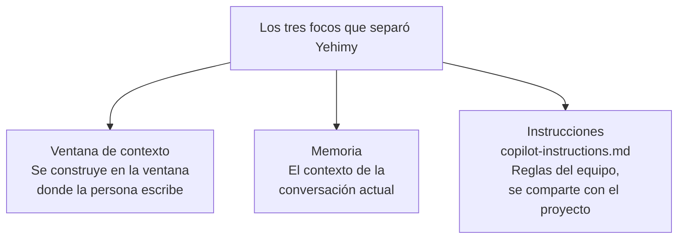
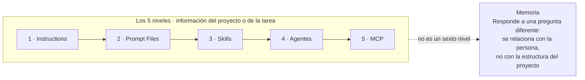
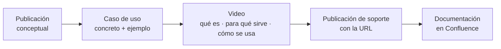

# Reunión semanal · GCO · 25 de agosto de 2026

> ⚠️ Generado por IA. Asegúrese de comprobar la precisión.

---

## Índice

- [Notas de la reunión](#notas-de-la-reunión)
  - [Aclaración de memoria e instrucciones de Copilot](#aclaración-de-memoria-e-instrucciones-de-copilot)
  - [Estructura conceptual de Skills, MCP y Agentes](#estructura-conceptual-de-skills-mcp-y-agentes)
  - [Producción de videos y vinculación documental](#producción-de-videos-y-vinculación-documental)
  - [Activación del canal de reservas uno a uno](#activación-del-canal-de-reservas-uno-a-uno)
- [Tareas de seguimiento](#tareas-de-seguimiento)
- [Resumen general](#resumen-general)
- [Actualizaciones clave](#actualizaciones-clave)

---

## Notas de la reunión

### Aclaración de memoria e instrucciones de Copilot

Yehimy, Óscar, Nibaldo, Jonatan y Salva revisaron la publicación sobre Copilot Memory y `copilot-instructions.md`, identificaron que la redacción **mezcla conceptos personales, de sesión y de equipo**, y acordaron reescribirla para que quede claro qué puede editarse, qué se aplica al proyecto y cómo funciona el contexto de una conversación.

#### Confusión conceptual

Óscar señaló que la publicación presenta Copilot Memory como un mecanismo donde se guardan preferencias personales de forma persistente, pero **no explica dónde se modifica** ni cómo se diferencia de `copilot-instructions.md`.

Salva confirmó que una persona que no conozca el tema podría interpretar que existe un archivo o ubicación específica para editar esa memoria.

#### Contexto de sesión

Jonatan explicó que Copilot Memory debía describirse como **el contexto de la conversación actual** y no como un objeto editable.

Nibaldo precisó que ese contexto se construye en la ventana donde la persona escribe, y que Copilot responde según las indicaciones y la forma de solicitarlas durante la interacción.

#### Instrucciones permanentes

Nibaldo aclaró que las preferencias que se quieren aplicar siempre **deben aterrizarse en instrucciones**. El archivo `copilot-instructions.md` representa las reglas del equipo, se comparte con el proyecto y puede contener convenciones como:

- Restricciones de SQL
- Formato COBOL
- Versión de .NET
- Prohibición de credenciales escritas directamente en el código

#### Acción de edición

Yehimy separó los conceptos en **tres focos**: ventana de contexto, memoria e instrucciones, y prepararía la parte gráfica para revisarla con el equipo.

El grupo acordó reescribir el contenido y revisar la nueva versión antes de publicar o republicar el material, con el objetivo de que la distinción quede clara durante la siguiente semana.

---

### Estructura conceptual de Skills, MCP y Agentes

Yehimy presentó el avance de las publicaciones sobre skills, prompt files, agentes y MCP, mientras Nibaldo y Óscar acordaron **mantener la explicación conceptual y complementarla con ejemplos prácticos**, para que también sea comprensible y utilizable por desarrolladores que aún no hayan realizado la formación.

#### Cinco niveles

Yehimy mostró la organización de los cinco niveles que enseñan información del proyecto o de la tarea a GitHub Copilot:

1. **Instructions**
2. **Prompt Files**
3. **Skills**
4. **Agentes**
5. **MCP**

También planteó que **la memoria no debía presentarse como un sexto nivel**, porque responde a una pregunta diferente y se relaciona con la persona, no con la estructura del proyecto.

#### Progreso editorial

Yehimy informó que **ya se había alcanzado la publicación 17**, correspondiente aproximadamente a la semana 10, y que los contenidos se estaban colocando primero en un canal interno de prueba de Raona.

El material se retiró del canal principal de GCO para evitar publicaciones prematuras y permitir que el equipo lo revise, corrija y ajuste.

#### Ejemplos de uso

Óscar indicó que la parte conceptual era necesaria, pero pidió **asociar cada skill, prompt o componente con un caso de uso concreto y un ejemplo ilustrativo**.

Nibaldo y Yehimy confirmaron que el siguiente paso sería desarrollar ejemplos visuales y demostraciones que expliquen cuándo utilizar cada elemento.

#### Contenido autoformativo

Óscar explicó que el contenido debe poder ser entendido por personas que no hayan completado la formación, incluidos nuevos desarrolladores que se incorporen posteriormente.

La documentación debe permitir una **introducción autónoma** mediante:

- Explicaciones claras
- Pasos guiados
- Ejemplos replicables
- Cuando corresponda, instrucciones o demostraciones de instalación

---

### Producción de videos y vinculación documental

Yehimy, Óscar y Nibaldo definieron que la siguiente fase será **producir videos** sobre los conceptos ya publicados, sus casos de uso y su instalación, vinculándolos con la documentación disponible en Confluence mediante enlaces incluidos en las publicaciones de soporte.

#### Objetivo de los videos

El equipo acordó pasar de la explicación conceptual a la aplicación práctica mediante videos que muestren **qué es cada componente, para qué sirve y cómo utilizarlo**.

Óscar pidió que las demostraciones fueran suficientemente concretas para que una persona pueda comprender y replicar el flujo.

#### Casos de uso

Yehimy planteó que el contenido podría dividirse en:

- **Uno o dos videos de casos de uso**
- **Un video dedicado** a explicar qué es el componente, cómo se instala y qué significa dentro del flujo de trabajo

Nibaldo confirmó que este es el paso lógico después de presentar los conceptos.

#### Enlaces a Confluence

Óscar solicitó relacionar cada publicación con la documentación existente en Confluence.

Yehimy explicó que el video estaría respaldado por una publicación que incluiría la URL correspondiente, de manera que las personas pudieran pasar del contenido audiovisual a la información técnica ampliada.

#### Plan de trabajo

Yehimy indicó que **coordinaría con Nibaldo la construcción de los videos durante la semana**. El resultado esperado es enriquecer las publicaciones conceptuales existentes con videos, publicaciones de soporte y enlaces documentales.

---

### Activación del canal de reservas uno a uno

Yehimy, Nibaldo, Jonatan, Óscar y Salva retomaron la activación del canal de reservas individuales, acordando **darlo a conocer formalmente mediante una comunicación a Informática después del regreso de vacaciones** y utilizarlo para gestionar solicitudes de ayuda concretas.

#### Dinámica de solicitudes

Nibaldo recordó que la dinámica inicial consiste en que una persona publique una solicitud de ayuda en el subcanal de reservas cuando tenga un problema concreto.

La atención se gestionará conforme vayan llegando las peticiones, ya que **no se espera una llegada masiva de solicitudes**.

#### Comunicación pendiente

Jonatan informó que está pendiente enviar un comunicado sobre la existencia del canal a las personas de Informática.

El envío se hará cuando regresen de vacaciones, para evitar que el mensaje se pierda entre los correos acumulados durante su ausencia.

#### Consulta ya respondida

Jonatan indicó que ya existía una consulta enviada y respondida en el canal, relacionada con Rafael. Salva confirmó que había respondido esa consulta, por lo que **el canal ya cuenta con un ejemplo de uso**.

#### Visibilidad del canal

Yehimy propuso aprovechar la comunicación pendiente para recordar que dentro del canal general existe el subcanal específico de reservas y animar a las personas a plantear allí sus preguntas.

El objetivo es hacer visible la opción y comenzar a generar actividad mediante solicitudes reales.

---

## Tareas de seguimiento

| Tarea | Descripción | Responsable |
|---|---|---|
| **Clarificación de memoria e instrucciones** | Reescribe la publicación sobre Copilot Memory y Copilot Instructions para distinguir claramente el contexto temporal de una sesión de las instrucciones persistentes y explicar dónde se modifica cada elemento. | Yehimy |
| **Revisión gráfica de la publicación** | Completa la parte gráfica de la publicación revisada y compártela para que el equipo confirme si la explicación resulta clara o requiere ajustes adicionales. | Yehimy |
| **Vídeos y casos de uso** | Desarrolla vídeos ilustrativos con casos de uso concretos, pasos de instalación o aplicación y enlaces a la documentación de Confluence para complementar las publicaciones conceptuales sobre skills, MCPs y agentes. | Yehimy, Nibaldo |
| **Comunicación del canal de reservas** | Envía a Informática una comunicación sobre la existencia y finalidad del subcanal de reservas para consultas individuales cuando las personas hayan regresado de vacaciones. | Jonatan |

---

## Resumen general

La reunión se centró en revisar y validar el material de comunicación que se viene desarrollando sobre skills, MCPs, agentes y GitHub Copilot, así como en identificar mejoras de claridad para su publicación.

También se evaluó cómo complementar los contenidos conceptuales con recursos prácticos que faciliten la adopción y comprensión por parte de los desarrolladores.

Además, se abordaron aspectos relacionados con la difusión de soporte y la activación de canales de consulta para los usuarios.

---

## Actualizaciones clave

### Revisión de publicaciones pendientes

Yehimy explicó el estado del contenido preparado, indicando que ya se habían desarrollado **17 publicaciones** basadas en el material recibido previamente, y que las piezas fueron trasladadas a un canal interno para permitir revisiones, correcciones y ajustes antes de su publicación definitiva.

Como siguiente paso, el equipo revisará los contenidos para validar que reflejan correctamente la información técnica trabajada.

### Clarificación del concepto de memoria e instrucciones

Yehimy presentó una propuesta para separar visual y conceptualmente la ventana de contexto, la memoria y las instrucciones, tras comentarios previos sobre la confusión generada en una publicación.

Óscar, Nibaldo, Salva y Jonatan debatieron la diferencia entre *"Copilot Memory"* y *"Copilot Instructions"*, concluyendo que **la redacción actual induce a interpretar la memoria como un elemento configurable y persistente**.

Se acordó reescribir el contenido para aclarar el concepto y revisar una nueva propuesta durante la próxima semana.

### Validación del enfoque formativo

Nibaldo indicó que los contenidos conceptuales resultan comprensibles para personas familiarizadas con la formación previa, mientras que Óscar insistió en que **también deben ser autoexplicativos para usuarios sin formación previa**.

Como resultado, se confirmó la necesidad de complementar la explicación conceptual con ejemplos prácticos y recursos de autoaprendizaje.

### Plan de vídeos y casos de uso

Óscar propuso incorporar demostraciones, ejemplos reales de uso, vídeos ilustrativos y guías prácticas de instalación para facilitar la adopción de skills y MCPs.

Yehimy confirmó que esta era la siguiente fase del trabajo, y se acordó desarrollar materiales audiovisuales acompañados por publicaciones de soporte y documentación asociada.

### Integración con documentación de referencia

Yehimy planteó vincular los futuros vídeos con documentación existente mediante enlaces de referencia y contenidos complementarios.

Nibaldo y Óscar respaldaron relacionar cada recurso formativo con documentación más extensa, para facilitar la consulta y la ampliación de conocimiento por parte de los usuarios.

### Definición del flujo de contenidos

El equipo revisó los temas más recientes sobre conectores, MCPs, skills y componentes relacionados, confirmando que **la secuencia lógica consiste en explicar primero los conceptos y posteriormente mostrar su aplicación práctica**.

Se acordó enriquecer las publicaciones existentes con ejemplos, vídeos y material complementario para reforzar la comprensión.

### Canal de reservas y consultas uno a uno

Yehimy retomó la conversación sobre el uso del canal de reservas para solicitudes de ayuda y sesiones individuales.

Nibaldo recordó que el mecanismo previsto era gestionar las peticiones directamente a través de ese canal, y se destacó que ya se había recibido y resuelto una consulta.

Como siguiente paso, se impulsará la visibilidad del canal mediante comunicaciones específicas dirigidas a los usuarios tras el periodo vacacional.

### Próximas acciones

Yehimy cerró la reunión confirmando que **comenzará la construcción de los vídeos junto con Nibaldo durante la semana** y que se continuará refinando el material relacionado con memoria, instrucciones y recursos de apoyo para las publicaciones futuras.
