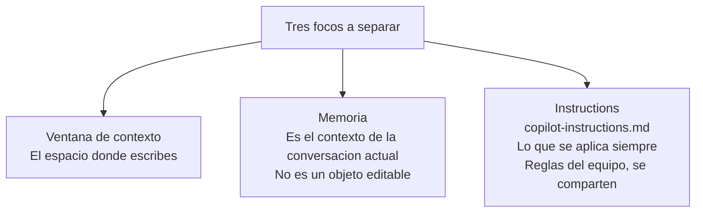
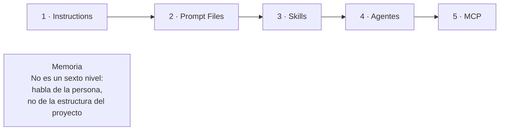
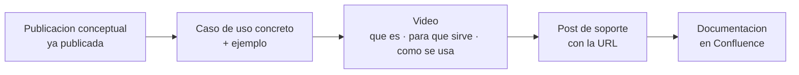

# Resumen de reunión · 25 de agosto de 2026
> Revisión semanal de estrategia de comunicación GitHub Copilot en Teams
> Con: Nibaldo Alfonso Pino Araya, Salvador Ivars Suárez (Raona) · Jonatan Hospital Adriao, Óscar Segura Herrera (GCO)
> Duración: 24 min 44 s · 11:00
> Fuentes: `Reuniones/[GCO] Transcripcion_reunion_semanal-25-08-26.docx` (transcripción literal de Teams) y `Reuniones/[GCO] reunion_semanal-25-08-26.md` (notas generadas por IA)
> Continúa desde: `resumen_reunion-seguimiento-semanal_18-08-26.md`

**Primera reunión con el equipo de Nibaldo de regreso de vacaciones.** Nibaldo y Salva no habían estado en la reunión del 18 ago, así que la primera parte fue ponerlos en contexto.

---

## Lo que se llevó a la reunión

| Punto | Estado que se presentó |
|---|---|
| Publicaciones retiradas de Teams GCO | Hecho — se retiraron del canal principal para evitar que salieran solas por la programación automática |
| Producción acumulada | Hasta la **Pub 17**, que corresponde aproximadamente a la semana 10 |
| Dónde vive todo | En el canal interno de prueba de Raona, para que el equipo revise, corrija y ajuste antes de la publicación definitiva |
| Ajuste pedido por Óscar el 18 ago | Propuesta de separación en tres focos, lista en texto — falta la parte gráfica |
| Tema abierto | La URL de Confluence para enlazar desde los posts |
| Tema abierto | Cómo activar las sesiones 1:1 |

---

## Temas

### 1. Memoria de GitHub Copilot vs. Instructions — se cerró el diagnóstico, no la solución

Este era el punto que quedó abierto el 18 ago. Hoy se pudo hablar con Nibaldo y quedó identificado **exactamente qué frase genera la confusión** y **cuál es la explicación técnica correcta**.

**Dónde está el problema — señalado por Óscar sobre la pieza publicada:**

> "Copilot Memory guarda tus preferencias personales, tu estilo de respuesta, lo que te funciona, cómo prefieres recibir el código, solo lo ves tú. No afecta a nadie más" — y justo debajo aparece `.github/copilot-instructions.md`.

Óscar lo resumió así: *"ese 'guarda tus preferencias personales' parece que sea algo que permanece en el tiempo, sesión a sesión"*. Y a la vez, tener `copilot-instructions.md` inmediatamente debajo hace pensar que la Memoria se guarda ahí.

**Salva lo confirmó desde la mirada de alguien que lo lee por primera vez:** *"leería esto y diría, vale... incluso podría interpretar que también se almacena en el copilot-instructions.md. El otro está súper claro, es un archivo, está en la carpeta `.github` y la puedo compartir. Pero lo otro es eso: ¿dónde está esa memoria mía que es personal? No dice dónde está."*

**La explicación correcta, según el equipo técnico:**

- **Jonatan:** la Memoria de GitHub Copilot es **el contexto de la conversación actual**. *"Es una explicación de lo que es, no algo que tú puedas editar."*
- **Nibaldo:** *"es básicamente el contexto, este espacio de ventana donde tú escribes, y por lo tanto empieza a responderte de acuerdo a lo que tú le vas pidiendo y cómo se lo vas pidiendo."*
- **Nibaldo, sobre lo que sí persiste:** *"si es siempre, entonces ese concepto etéreo se aterriza en lo que es el instruction."* Las preferencias que se quieren aplicar **siempre** van en `copilot-instructions.md`, que son las reglas del equipo y se comparten con el proyecto: restricciones de SQL, formato COBOL, versión de .NET, prohibición de credenciales escritas directamente en el código.

**La propuesta de Yehimy que se presentó:** separar el asunto en **tres focos** — la ventana de contexto (el cajón), la Memoria y las Instructions — dentro del mismo post, y publicarlo como hilo dentro de la conversación ya existente, sin duplicar el post original.

**Cierre del tema:**
- Nibaldo: *"esto es sencillo, es como reescribirlo."*
- Yehimy termina la parte gráfica y la comparte para que el equipo confirme si queda clara.
- **Fecha objetivo: la próxima semana** — se revisa la nueva versión antes de publicar o republicar el material.

> ✅ **Cierre el mismo día (nota añadida el 25 ago por la tarde).** El post se reescribió y se publicó en Teams Raona editando el post existente. **Lo que se hizo difiere de lo que se planteó en la reunión:** en vez de tres focos, quedaron **dos** — lo que dura la conversación y lo que dura siempre. Razón: si la Memoria es el contexto de la conversación actual, es lo mismo que el "cajón" que ya explicó Pub 3, así que el primer y el segundo foco eran el mismo bajo dos nombres. Sacar "Copilot Memory" de la pieza resuelve la pregunta de Óscar (*"¿dónde lo modifico?"*) y hace que el post aguante las dos respuestas posibles a la pregunta que queda abierta con Nibaldo. Archivo: `post-una-vez-o-siempre_pub4.md`.

> El diagrama de abajo recoge **lo que se planteó en la reunión**, no lo que finalmente se produjo.

---

### 2. Serie Skills, MCP y Agentes — validada conceptualmente, con una condición

Yehimy recorrió el material publicado en el canal interno: la parte general de la gco-dev-suite, qué es y qué no es una Skill, los cinco niveles (Instructions, Prompt Files, Skills, Agentes, MCP) y los dos posts de MCP publicados ayer — "Las llaves de los sistemas" (los 5 conectores) y "De cinco pestañas a una frase" (MCP en acción).

**Sobre dónde ubicar la aclaración de la Memoria:** Yehimy planteó si la distinción debía quedarse en el bloque de los cinco niveles o subirse a la Pub 4. **Nibaldo respondió que donde está no le parece mal.** La ampliación va, entonces, como hilo de la Pub 4, tal como se había acordado el 18 ago.

**Nibaldo sobre la comprensión del material:** hoy la mayoría de los desarrolladores ya pasó por la formación y tiene una relación mínima con lo que es una Skill o un MCP. El flujo que deberían entender es simple: *"tienes esta cajita de herramientas, y estas son las herramientas que puedes ocupar; si necesitas algo más, nos lo pides."* Desde su perspectiva, el material se entiende — pero pidió expresamente que Óscar confirmara, *"porque me pasaba lo mismo con el anterior, que yo también creía que se entendía."*

**La condición que puso Óscar — y es el punto que marca el trabajo de las próximas semanas:**

1. **La parte conceptual ya está dada. Falta el ejemplo de uso concreto.** *"Vamos a utilizar este skill, este skill es para esto, y un ejemplo de uso concreto de para qué"*, más un vídeo ilustrativo del uso.
2. **El contenido tiene que ser autoformativo.** No está hecho para quien ya hizo la formación — esa persona ya la hizo. Está hecho para **quien no la ha hecho** y entra a leer: *"tiene que ser lo suficientemente claro para que alguien que no ha hecho la formación pueda entender ese concepto."*
3. **Incluye a los que aún no han llegado.** Óscar fue explícito: si en septiembre entra un desarrollador nuevo que nunca ha tocado GitHub Copilot, un compañero tiene que poder decirle *"te vas aquí"* y que ahí encuentre pasos guiados para empezar por su cuenta, sin esperar a la siguiente formación.
4. **Acceso a la documentación de instalación**, e incluso un vídeo que muestre la instalación.

Nibaldo cerró de acuerdo: *"aparte de los vídeos, los casos de uso y algo más visual que ellos puedan replicar."*

---

### 3. Vídeos y enlace a Confluence — es la fase que arranca esta semana

Los tres coincidieron en que el paso lógico ahora es pasar del concepto a la aplicación. Nibaldo: *"el flujo lógico: ahora que ya lo hablamos conceptualmente, lo aplicamos."*

**Reparto de vídeos que planteó Yehimy — dos o tres piezas:**

- **Uno o dos vídeos de casos de uso** (la cantidad depende de cuántos casos entren).
- **Un vídeo dedicado** a qué es el componente, cómo se instala y qué significa dentro del flujo de trabajo.

**Enlace a Confluence.** Óscar lo reiteró: *"si aquí tenemos un enlace en Confluence que explica qué es esto, pues meter aquí el enlace para que esté vinculado una cosa con la otra."* Nibaldo estuvo de acuerdo. El mecanismo acordado: **el vídeo va soportado por un post, y en ese post va la URL de Confluence** — así, si el proceso de instalación cambia, el post no hay que editarlo.

> **La URL sigue sin entregarse.** Yehimy la pidió expresamente en la reunión. Es el mismo pendiente que quedó abierto el 18 ago.

**Compromiso de cierre:** Yehimy coordina la construcción de los vídeos con Nibaldo **durante esta semana**.

---

### 4. Sesiones 1:1 — cómo se activa el subcanal de Reservas

Yehimy puso el tema sobre la mesa aprovechando que estaban todos: *"lo hablamos, pero no lo trabajamos."*

**La dinámica confirmada (Nibaldo):** es la misma que se había acordado antes. Quien tenga un problema concreto escribe *"necesito ayuda"* en el subcanal de **Reservas**, y desde ahí se gestiona a medida que llegan. **No se espera un volumen masivo** — serán solicitudes sueltas.

**Lo que falta por parte de GCO (Jonatan):** enviar un comunicado a Informática anunciando la existencia del canal. La gente de Informática **ya está dentro del canal**, pero nunca se les comunicó formalmente — cuando alguien le pregunta algo, Jonatan les dice que lo planteen ahí, pero no ha habido un correo. **Se enviará cuando vuelvan de vacaciones**, no ahora: *"volverán de vacaciones, tendrán 4000 correos, dirán 'vale, luego me lo miro' y no se lo van a mirar."*

**El canal ya tiene un caso de uso real.** Jonatan informó que hay una consulta enviada y ya respondida — la de Rafael. Salva confirmó que fue él quien la respondió.

**Propuesta de Yehimy:** aprovechar ese correo para añadir después una respuesta que recuerde que, dentro del canal grande que ya conocen, existe uno específico para preguntar. Y usar la consulta de Rafael como primer contenido visible del canal — *"nuestra primera pregunta ha sido tal, el desarrollo de la pregunta fue tal cosa"* — para darle movimiento y que la gente entienda que ese es un sitio donde puede escribir.

---

## Tareas de seguimiento

| # | Tarea | Responsable | Fecha |
|---|-------|-------------|-------|
| 1 | Terminar la parte gráfica del hilo que separa ventana de contexto, Memoria e Instructions, y compartirla para validación | Yehimy | Hoy |
| 2 | Reescribir el texto de la Memoria con la explicación correcta (contexto de la conversación actual, no objeto editable) y revisarlo con el equipo antes de publicar o republicar | Yehimy | Próxima semana |
| 3 | Construir los vídeos: uno o dos de casos de uso + uno de qué es / cómo se instala | Yehimy + Nibaldo | Esta semana |
| 4 | Asociar cada Skill, Prompt File o componente con un caso de uso concreto y un ejemplo ilustrativo | Yehimy + Nibaldo | Siguiente bloque |
| 5 | Entregar la URL de Confluence con la documentación, para enlazarla desde los posts de soporte | Nibaldo | Pendiente desde el 18 ago |
| 6 | Enviar el comunicado a Informática sobre la existencia del subcanal de Reservas | Jonatan | Al regreso de vacaciones del equipo de GCO |
| 7 | Publicar en el subcanal de Reservas la consulta de Rafael como primer caso visible | Yehimy | Por definir |

---

## Consecuencias directas sobre lo que ya está producido

| Pieza | Qué pasa con ella |
|---|---|
| **Pub 4 — post "Memoria vs. Instrucciones"** | ✅ **Resuelto el mismo día.** Reescrito como **"Una vez o siempre"** y republicado en Teams Raona el 25 ago. Cambia el eje: de *tuyo vs. del equipo* a **lo que dura la conversación vs. lo que dura siempre**. "Copilot Memory" sale de la pieza. Archivo: `post-una-vez-o-siempre_pub4.md` |
| **Hilos `4-a` y `4-b`** | ⛔ **Deprecados el 25 ago.** Existían para parchear el post original sin tocarlo; al reescribirse en origen, dejaron de tener sentido. Además arrastraban la misma premisa desmentida (*"la Memoria dura entre sesiones, y es tuya"*). Nunca se produjeron sus piezas. En `deprecados/`, con su motivo |
| **Pub 3** — *"GitHub Copilot no tiene memoria permanente. Tiene un cajón"* | Coherente con lo que se explicó hoy. No requiere cambios |
| **Hilo 14a** — *"Los 5 niveles hablan del proyecto, Memoria habla de ti"* | 🟠 **Pendiente, y con dos problemas.** (1) Cierra apuntando al hilo `4-a`, que quedó deprecado — enlace roto. (2) Se apoya en el eje *"¿esto es mío o del equipo?"*, el mismo que se abandonó en Pub 4. **Cómo se reescriba depende de la respuesta de Nibaldo** sobre si Memoria y el cajón son lo mismo. Está publicado solo en Raona, hay margen |
| **Pub 16 y Pub 17** (los 5 conectores · MCP en acción) | Se mostraron en la reunión, se comentaron como el contenido de la semana. Ninguna observación de corrección |
| **Pub 12 a Pub 17** | Validadas conceptualmente. La condición es que ahora se les añada caso de uso, ejemplo y vídeo |

---

## Qué NO se trató hoy (sigue abierto del 18 ago)

| Ítem | Responsable | Nota |
|---|---|---|
| ¿`dotnet-review` y `cobol-analyzer` son parte real de las 32 skills? | Nibaldo | No se preguntó en la reunión. Sigue bloqueando el cierre de Pub 15 para GCO |
| ¿"gco-dev-suite" es la misma "Copilot Dev Suite" del guion del Vídeo 04? | Nibaldo | Sin tratar |
| Fecha de la sesión AMA | Nibaldo + Guillermo | Sin tratar. Bloqueada desde junio |
| Calendario de republicación en Teams GCO (retoma prevista 14 sep, en orden de creación) | — | No se mencionó. Se mantiene lo acordado el 18 ago |
| Alcance real de lo auto-publicado en Pub 4 | Yehimy | Sin tratar |
| Los dos arreglos de texto pendientes: el hilo 14a dice "le enseña a Copilot" sin "GitHub"; el post de Pub 14 se quedó sin el puente final a Pub 15 | Yehimy | Sin tratar |

> **Pregunta que queda planteada:** hasta hoy, las sesiones 1:1 figuraban como bloqueadas por Microsoft Bookings sin configurar. La dinámica que se confirmó en la reunión no usa Bookings — es escribir en el subcanal de Reservas y gestionar a medida que llegan. **Falta confirmar si esa dinámica sustituye a Microsoft Bookings o si conviven.** No se dijo en la reunión y no debe darse por resuelto.

---

## Nota sobre las fuentes

Este resumen se escribió contra la **transcripción literal** de Teams. Las notas generadas por IA (`[GCO] reunion_semanal-25-08-26.md`) se usaron como apoyo de estructura, pero en un punto son engañosas: presentan la lectura de Óscar — que la Memoria guarda preferencias de forma persistente — como si fuera lo que la publicación *debía* decir, cuando en la reunión se estableció justamente lo contrario. Ese matiz es el núcleo del tema y aquí se recoge según lo que dijeron Jonatan y Nibaldo.
